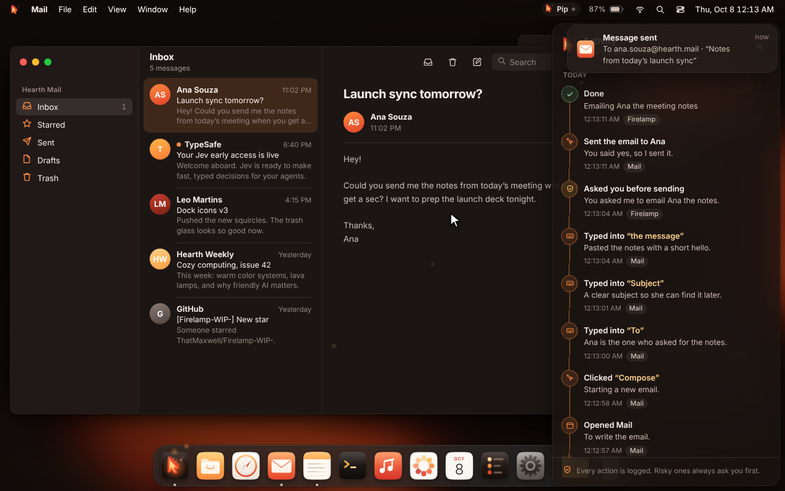

<p align="center"></p>

<h1 align="center">Firelamp OS</h1>
<p align="center">The best operating system for AI automation. Arch-based. Cozy on purpose.</p>

<p align="center"></p>

The whole OS exists so an AI can use the computer the way you do, only much faster. It gets
its own **fire cursor** that moves, clicks and types right next to yours. You can watch it,
pause it, stop it, or keep working at the same time.

## What's here

**`shell/`** is the desktop: menu bar, Mac-style dock, windows, the fire cursor, the activity
timeline and the safety controls. It is plain HTML, CSS and JS with no build step, so it can be
developed and checked in any browser before it goes in the ISO.

| | |
|---|---|
|  | **Dock.** Dark grey backing, magnification with a cosine falloff that pushes neighbours apart, launch bounce, running dots, labels. |
|  | **Fire cursor.** Glides on soft arcs, leaves embers, drags files, and its flame boils like hand-drawn animation. |
|  | **No screenshots.** The AI reads the live UI tree: every element's role, label and exact bounds, updated the instant anything changes. *View → Show what the AI sees* draws it on screen. |
|  | **Activity timeline.** Every action, with the reason it was taken. |

**Safety.** Risky actions (sending, deleting, paying) open an OS-level permission sheet. It is
hidden from the AI's UI tree, so only a human can answer it. **Esc** stops the AI instantly and
**Ctrl Space** pauses it, from anywhere, including mid-move.

**Moving static.** A few components redraw their outline three times a loop, like hand-inked
animation: the fire cursor's flame, the AI capsule, permission sheets, target marks and the
timeline spine. Everything else stays still and crisp. See `shell/js/boil.js`.

**First boot** asks you to name your assistant. There is no default name.

## Run it

```sh
python3 -m http.server 8765        # from the repo root
# open http://localhost:8765/shell/
```

Try the chips in the assistant window, or **⌥ Space** / **Ctrl K** for the Ask bar.
Handy URL flags: `?name=Pip` skips naming, `?nosplash`, `?reset`, `?still` freezes the wallpaper.

On the OS the same page runs full screen as the session shell (a WebKitGTK layer-shell surface
on Wayland). For native apps the UI tree comes from AT-SPI2 over D-Bus instead of the DOM.

## How the AI part fits together

```
you ──ask──▶ brain (LLM: plans the steps)            shell/js/agent/plans.js   (demo plans for now)
                └─▶ reflexes (Jev: picks the element) shell/js/uitree.js find() (a small scorer stands in)
                       └─▶ hands (fire cursor)        shell/js/agent/agent.js + cursor.js
                              └─▶ timeline + permission sheets
```

This build runs in demo mode: three hand-written plans (“Email Ana my meeting notes”,
“Tidy up my Downloads”, “Show me what you see”) exercise the full loop end to end.

## Brand

`brand/` has the logos as SVG, traced from the originals (under 1% pixel difference):
`firelamp-cursor.svg`, an animated version with the boiling flame and floating spark, and
`thatmaxwell.svg`, built from one petal rotated eight times so it is easy to play with.
Palette: ember `#E2402A`, orange `#FF8A3D`, amber `#FFB547`, cream `#FFD08A` on warm darks.

## Checking the UI without a VM

`node tools/capture.mjs` (needs Playwright and ffmpeg, with the server above running) records
every scene above and rewrites `docs/media/`.

---

Made with care by [ThatMaxwell](https://github.com/thatmaxwell). Fonts: Inter and JetBrains Mono (SIL OFL).
