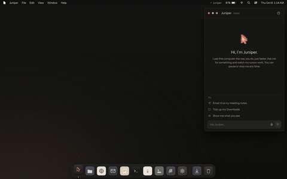
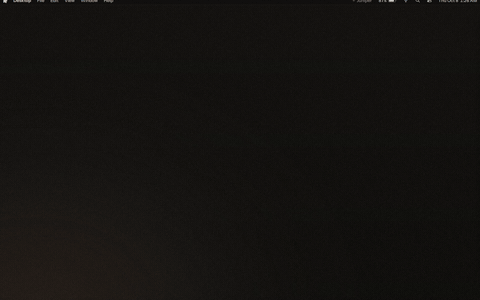
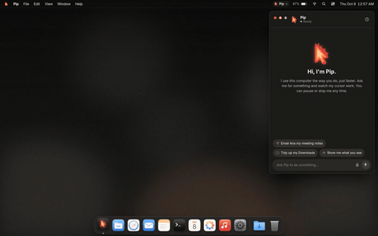
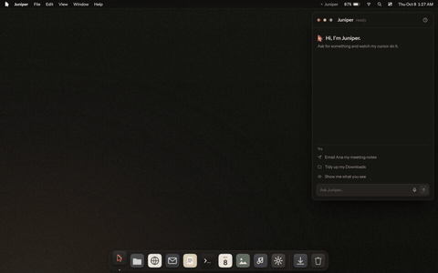
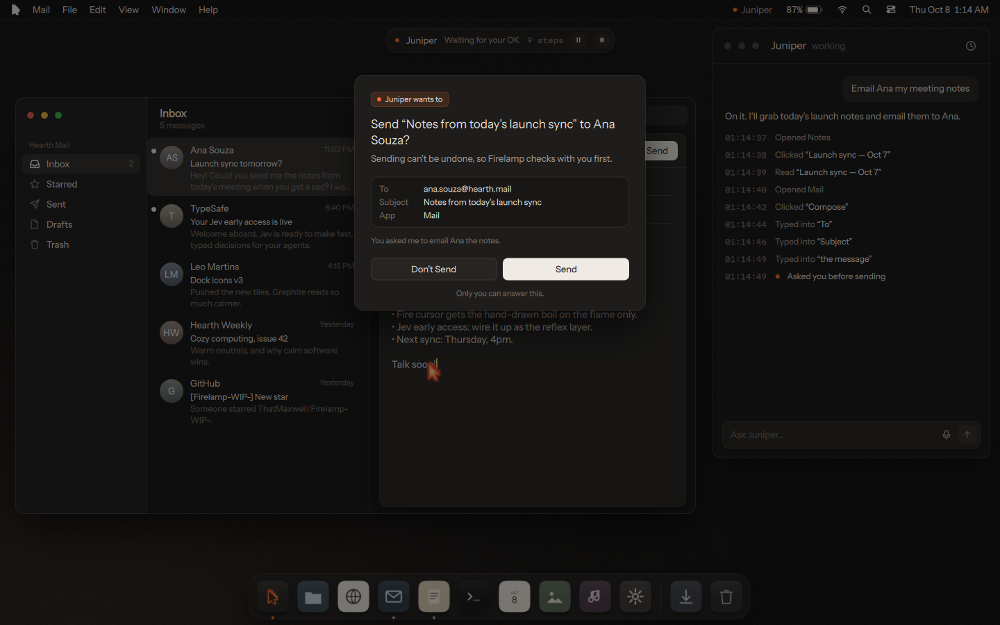

<p align="center"></p>

<h1 align="center">Firelamp OS</h1>
<p align="center">The best operating system for AI automation. Arch-based. Cozy on purpose.</p>

<p align="center"></p>

The whole OS exists so an AI can use the computer the way you do, only much faster. It gets
its own **fire cursor** that moves, clicks and types right next to yours. You can watch it,
pause it, stop it, or keep working at the same time.

## What's here

**`shell/`** is the desktop, written in Qt Quick (QML): menu bar, Mac-style dock, windows,
eleven apps, the fire cursor, the activity timeline and the safety controls. The ISO build copies
it to `/usr/share/firelamp/shell` and the session starts it with Qt's `qml` tool on labwc.

**`prototype/web/`** is the first HTML/CSS/JS sketch of the same desktop, kept for reference.

| | |
|---|---|
|  | **Dock.** Our own icon family on muted neutral tiles; only the Assistant is ember. Magnification with a cosine falloff, running dots, labels. |
|  | **Fire cursor.** Moves on a Fitts path with minimum-jerk easing, settles, shows one small tag naming what it is about to touch, then acts. No outlines, no trail; it fades when idle. |
|  | **No screenshots.** The AI reads the live UI tree: every element's role, label and exact bounds, updated the instant anything changes. *View → Show what the AI sees* draws it on screen. |
|  | **Permission sheets.** Sending, deleting and paying always stop and ask you. Every action also lands in the activity timeline with the reason it was taken. |

**Safety.** Risky actions (sending, deleting, paying) open an OS-level permission sheet. It is
hidden from the AI's UI tree, so only a human can answer it. **Esc** stops the AI instantly and
**Ctrl Space** pauses it, from anywhere, including mid-move.

**Moving static.** Only the AI's own marks boil on a three-frame loop, like hand-inked
animation: the fire cursor's flame, its target tag and click ring, and the logo on the splash and
About screens. Everything else stays still and crisp. See `shell/js/logo.js`.

**First boot** asks you to name your assistant. There is no default name.

## Run it

```sh
qml shell/Main.qml -- --windowed --name=Juniper     # Qt 6.5+ with qt6-declarative, qt6-svg
```

Try the chips in the assistant window, or **⌥ Space** / **Ctrl K** for the Ask bar.
Flags after `--`: `--name=…` skips naming, `--nosplash`, `--reset`, `--still` freezes the
wallpaper, `--windowed` instead of full screen.

Every control the AI can use carries a name and role (`aiName`, `aiRole`) and sets the same
`Accessible.name`, so the tree the shell reads internally is the one AT-SPI2 publishes for
native apps.

## How the AI part fits together

```
you ──ask──▶ brain (LLM: plans the steps)            shell/js/plans.js         (demo plans for now)
                └─▶ reflexes (Jev: picks the element) shell/js/uitree.js find() (a small scorer stands in)
                       └─▶ hands (fire cursor)        shell/components/Agent.qml + FireCursor.qml
                              └─▶ timeline + permission sheets
```

This build runs in demo mode: three hand-written plans (“Email Ana my meeting notes”,
“Tidy up my Downloads”, “Show me what you see”) exercise the full loop end to end.

## The ISO

`iso/` builds the bootable image (archiso, labwc on Wayland). It copies `shell/` into the image and
starts `shell/Main.qml` as the session. See [`iso/README.md`](iso/README.md).

## Launch site

The launch site lives in [`docs/`](docs/) and is plain HTML, CSS and JS with no build step: a language picker (English / Português), a 2-second loader, a ~30s launch intro rendered live in code with a soundtrack synthesized in the browser (Web Audio), then the scroll-animated site.

To publish it: **Settings → Pages → Deploy from a branch → `main` / `/docs`**.

To preview locally: `npx http-server docs` and open http://localhost:8080.

## Brand

`brand/` has the logos as SVG, traced from the originals (under 1% pixel difference):
`firelamp-cursor.svg`, an animated version with the boiling flame, and
`thatmaxwell.svg`, built from one petal rotated eight times so it is easy to play with.
Palette and motion follow the design direction (`shell/components/Theme.qml` holds the tokens):
graphite surfaces `#121110`–`#312E2B`, cream text `#EFEAE4`, and ember `#F26A2E` only on what the AI owns.
The logo keeps ember `#E2402A`, orange `#FF8A3D` and cream `#FFD08A`.

## Checking the UI without a VM

```sh
xvfb-run -a -s "-screen 0 1440x900x24" python3 tools/qml_capture.py email out/ 42000
```

`tools/qml_capture.py` (PySide6 + ffmpeg) loads `shell/Main.qml` under Xvfb, drives a scene
(`desktop`, `dock`, `email`, `tidy`, `vision`) and records it; the clips in `media/qt/` come from
it. `prototype/capture.mjs` does the same for the web prototype.

---

Made with care by [ThatMaxwell](https://github.com/thatmaxwell). Fonts: Instrument Sans and Martian Mono, bundled in `shell/fonts/` (SIL OFL).
